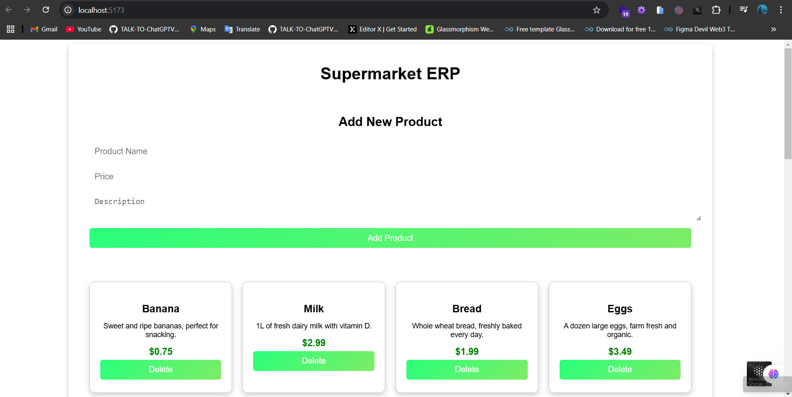
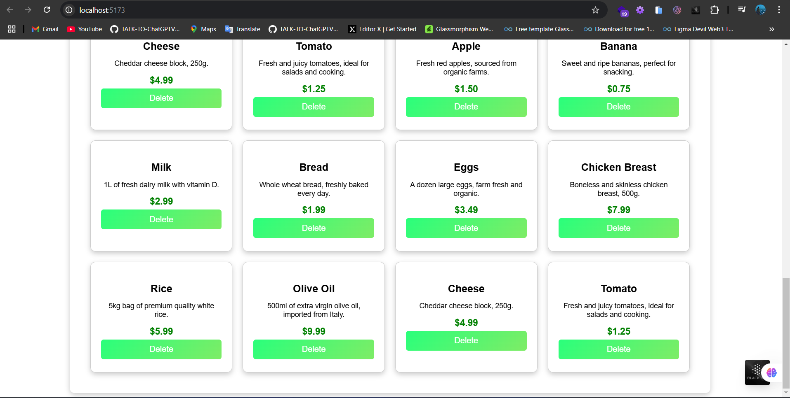

# 🛒 Supermarket ERP (React + Node.js + MySQL)

## 📌 Project Overview
This is a **Supermarket ERP System** built with:
- 🎨 **Frontend:** React, Vite, TypeScript
- ⚙️ **Backend:** Node.js, Express.js, MySQL (Local Database)
- 🗄️ **Database:** MySQL (running locally on `localhost`)

## 📂 Folder Structure
```
backend/
├── 📁 node_modules/
├── 📄 package.json
├── 🚀 server.js           # Express server setup
├── 📁 models/
│   ├── 📄 Product.js      # MySQL Schema for products
├── 📁 routes/
│   ├── 📄 productRoutes.js     # API routes for fetching products
├── 📁 controllers/
│   ├── 📄 productController.js # Logic for handling product requests
├── 📁 config/
│   ├── 📄 db.js           # MySQL connection logic

frontend/
├── 📁 node_modules/
├── 📂 src/
│   ├── 📂 components/
│   │   ├── 🎨 ProductCard.tsx  # Product UI component
│   ├── 📂 pages/
│   │   ├── 🏠 HomePage.tsx     # Fetches products from backend
│   │   ├── 🎨 HomePage.css     # Styles for homepage
│   ├── 📂 services/
│   │   ├── 🌐 api.ts           # API call logic
│   ├── 🏗️ App.tsx              # Main application file
│   ├── 🚀 main.tsx             # React entry point
│   ├── 🎨 index.css            # Styles
├── 📂 public/
│   ├── 📄 index.html           # Root HTML file
```

## 🌟 UI Screenshots
### 🏠 Home Page


### 📝 Products List



## ⚙️ Setup Instructions
### 🖥️ Backend Setup
1. Navigate to the `backend` folder:
   ```sh
   cd backend
   ```
2. Install dependencies:
   ```sh
   npm install
   ```
3. Start the backend server:
   ```sh
   node server.js
   ```
4. The server will run at 🌐 `http://localhost:5000/`

### 💻 Frontend Setup
1. Navigate to the `frontend` folder:
   ```sh
   cd frontend
   ```
2. Install dependencies:
   ```sh
   npm install
   ```
3. Start the frontend server:
   ```sh
   npm run dev
   ```
4. Open 🌍 `http://localhost:5173/` in your browser.

## 🔌 API Endpoints
### 📦 Fetch All Products
- **Endpoint:** `GET /api/products`
- **Response:**
  ```json
  [
    {
      "_id": "65f1a5b4dcd94b001c2e6c8a",
      "name": "🍎 Apple",
      "price": 1.99,
      "description": "Fresh red apple"
    },
    {
      "_id": "65f1a5b4dcd94b001c2e6c8b",
      "name": "🍌 Banana",
      "price": 0.99,
      "description": "Yellow ripe banana"
    }
  ]
  ```

## 📝 Notes
- 🗄️ **MySQL must be running locally** and properly configured.
- 🔄 The frontend dynamically fetches product data from the backend.
- ⚠️ No UI changes were made—only the database connection was updated.

## 👨‍💻 Author
Developed as part of the **Security and Compliance in the Cloud** coursework by **Thenuja Dulwana**. 🚀📚


